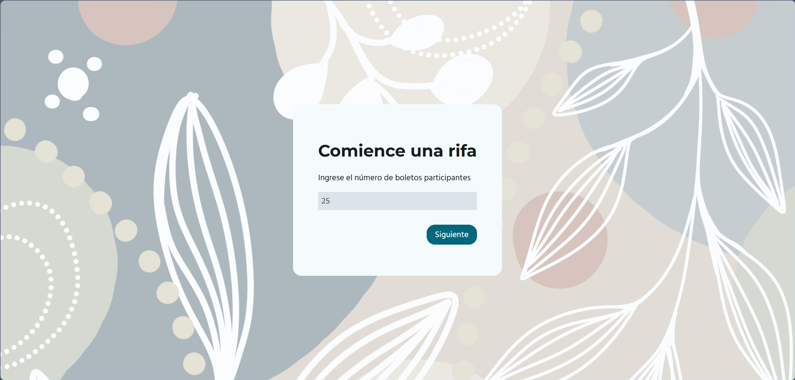
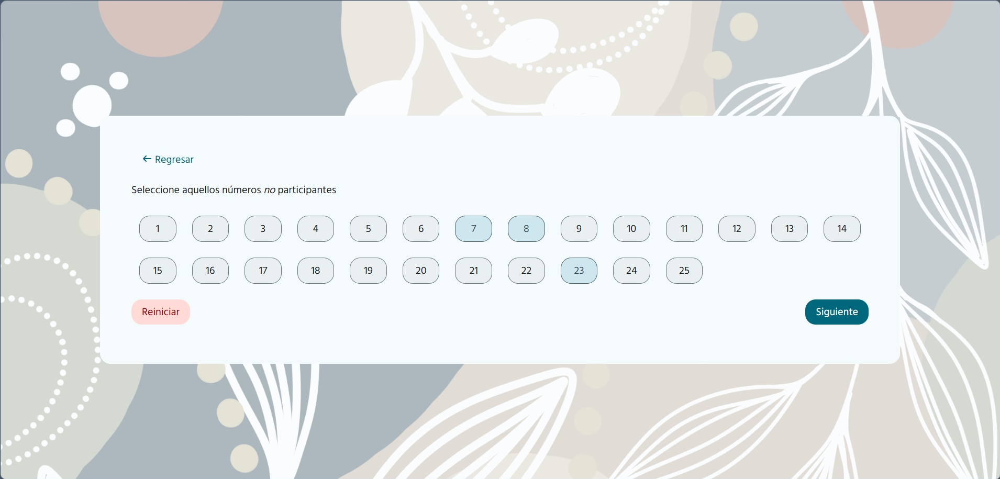

# Raffle

This is a raffle application.

## How to use?

To use the raffle application, open the index.html file in a web browser. Then enter the number of participating tickets.

Select the tickets that aren't participating and click "Siguiente." If all tickets participate, simply click "Siguiente."

Use the "Reiniciar" button to reset your selection and the "Regresar" button to go back to the first page.

You can then click the "Sortear" button to generate a new winning number until there are no more numbers.

## Assets

- Background image by [Steffi Ihrig](https://pixabay.com/es/users/pfefferminza_viktualia-41374046/?utm_source=link-attribution&utm_medium=referral&utm_campaign=image&utm_content=9173953) from [Pixabay](https://pixabay.com/es//?utm_source=link-attribution&utm_medium=referral&utm_campaign=image&utm_content=9173953)

- [Montserrat](https://fonts.google.com/specimen/Montserrat) and [Hind Madurai](https://fonts.google.com/specimen/Hind+Madurai) fonts from [Google Fonts](https://fonts.google.com/)

- Icons by [Font Awesome Free](https://fontawesome.com/)
